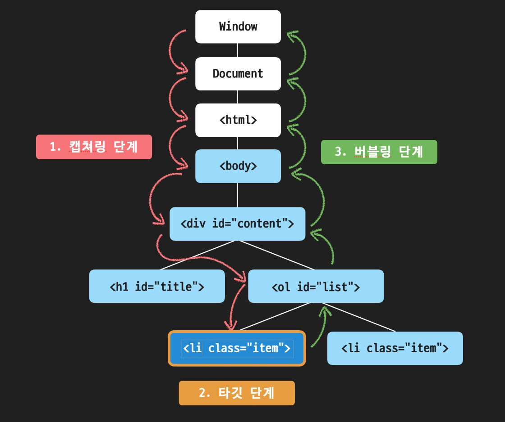

# 인터랙티브 자바스크립트


## 1. 자바스크립트로 태그 선택하기
| 메소드                                       | 의미                              | 결과                                               |
|-------------------------------------------|---------------------------------|--------------------------------------------------|
| `document.getElementById('id')`            | HTML id속성으로 태그 선택하기        | id에 해당하는 태그 하나                               |
| `document.getElementsByClassName('class')` | HTML class속성으로 태그 선택하기     | class에 해당하는 태그 모음 (HTMLCollection)             |
| `document.getElementsByTagName('tag')`     | HTML 태그 이름으로 태그 선택하기      | tag에 해당하는 태그 모음 (HTMLCollection)                |
| `document.querySelector('css')`            | css 선택자로 태그 선택하기          | css 선택자에 해당하는 태그 중 가장 첫번째 태그 하나                |
| `document.querySelectorAll('css')`         | css 선택자로 태그 선택하기          | css 선택자에 해당하는 태그 모음 (NodeList)                 |


## 2. 유사 배열이란?

- 배열과 유사한 객체 ex) HTMLCollection, NodeList, DOMTokenList,..

### 특징

1. 숫자 형태의 indexing이 가능하다.

2. `length` 프로퍼티가 있다.

3. 배열의 기본 메소드를 사용할 수 없다.

4. `Array.isArray(유사배열)` 의 리턴값은 `false` 이다.


## 3. 이벤트와 이벤트 핸들링, 그리고 이벤트 핸들러

- 이벤트: 웹 페이지에서 발생하는 대부분의 일(사건)들

    ex) 버튼 클릭, 스크롤, 키보드 입력, …

- 이벤트 핸들링: 자바스크립트를 통해 이벤트를 다루는 일
- 이벤트 핸들러: 이벤트가 발생했을 때 일어나야하는 구체적인 동작들을 표현한 코드.

    `이벤트 리스너(Event Listener)` 라고도 부른다.

    ⇒ 이벤트 핸들러의 첫번째 파라미터에는 자동으로 이벤트 객체가 전달된다.


## 4. 이벤트 핸들러를 등록하는 2가지 방법

### 4-1) 자바스크립트로 해당 DOM 객체의 onclick 프로퍼티에 등록하기

```jsx
const btn = document.querySelector('#myBtn');

btn.onclick = function() {
  console.log('Hello Codeit!');
};
```

### 4-2) HTML 태그의 onclick 속성에 바로 표시하기
```jsx
<button id="myBtn" onclick="console.log('Hello Codeit!')">클릭!</button>
```

<br><br>

# 브라우저와 자바스크립트

## 1. window 객체

- `window` 객체는 브라우저 창을 대변하면서 자바스크립트에서 최상단에 존재하는 객체입니다.
- 자바스크립트 코드 어느 곳에서나 항상 접근할 수 있는 객체이기 때문에 전역 객체, 영어로는 Global Object라고 부릅니다.
- 어떤 프로퍼티나 메소드를 사용하든 결국 전역 객체 내부의 것이기 때문에 앞에 `window.` 을 생략할 수도 있습니다.

## 2. DOM

- DOM이란 Document Object Model의 약자로 한국어로는 문서 객체 모델 입니다.
- 간단하게 표현하면 웹 페이지에 나타나는 HTML 문서 전체를 객체로 표현한 것으로 생각하면 됩니다.
- 이때 각 객체를 노드(Node)라는 용어로 표현하고, 태그는 요소 노드, 문자는 텍스트 노드로 구분됩니다.

## 3. DOM 트리

- HTML의 계층 구조는 DOM에서도 반영되는데 이러한 계층구조를 나무에 비유해서 DOM 트리라고 부릅니다.
- 각 노드 간의 관계는 부모, 자식, 형제라는 용어로 표현합니다.

## 4. DOM 이동 시 활용 가능한 프로퍼티
| 프로퍼티                                | 유형            | 결과                                                        |
|----------------------------------------|---------------|-----------------------------------------------------------|
| `element.children`                     | 자식 요소 노드     | `element`의 자식 요소 모음 (HTMLCollection)                    |
| `element.firstElementChild`            | 자식 요소 노드     | `element`의 첫 번째 자식 요소 하나                                 |
| `element.lastElementChild`             | 자식 요소 노드     | `element`의 마지막 자식 요소 하나                                |
| `element.parentElement`                | 부모 요소 노드     | `element`의 부모 요소 하나                                    |
| `element.previousElementSibling`       | 형제 요소 노드     | `element`의 이전(previous) 혹은 좌측(left)에 있는 요소 하나        |
| `element.nextElementSibling`           | 형제 요소 노드     | `element`의 다음(next) 혹은 우측(right)에 있는 요소 하나          |
| `node.childNodes`                      | 자식 노드        | `node`의 자식 노드 모음 (NodeList)                                |
| `node.firstChild`                      | 자식 노드        | `node`의 첫 번째 자식 노드 하나                                  |
| `node.lastChild`                       | 자식 노드        | `node`의 마지막 자식 노드 하나                                  |
| `node.parentNode`                      | 부모 노드        | `node`의 부모 요소 하나                                      |
| `node.previousSibling`                 | 형제 노드        | `node`의 이전(previous) 혹은 좌측(left)에 있는 노드 하나           |
| `node.nextSibling`                     | 형제 노드        | `node`의 다음(next) 혹은 우측(right)에 있는 노드 하나             |

## 5. 주요 요소 노드 프로퍼티

| 프로퍼티                | 내용                                           | 참고사항                                                                                      |
|-------------------------|----------------------------------------------|-------------------------------------------------------------------------------------------|
| `element.innerHTML`     | 요소 노드 내부의 HTML코드 문자열로 리턴                     | 요소 안의 정보를 확인할 수도 있지만, 내부의 HTML 자체를 수정할 때 좀 더 자주 활용                          |
| `element.outerHTML`     | 요소 노드 자체의 전체적인 HTML 코드를 문자열로 리턴            | `outerHTML`은 새로운 값을 할당하면 요소 자체가 교체되어 버리기 때문에 주의                               |
| `element.textContent`   | 요소 노드 내부의 내용들 중에서 HTML을 제외하고 텍스트만 리턴    | `textContent`는 말 그대로 텍스트만 다루기 때문에 HTML 태그를 쓰더라도 모두 텍스트로 처리됨                        |

## 6. 요소 노드 다루기

### 1. 요소 노드 만들기: `document.createElement('태그이름')`

### 2. 요소 노드 꾸미기: `element.textContent, element.innerHTML, ...`

### 3. 요소 노드 추가 혹은 이동하기: `element.prepend, element.append, element.after, element.before`

### 4. 요소 노드 삭제하기: `element.remove()`

## 7. HTML 속성 다루기

- 대부분의 HTML 속성은 DOM 객체의 프로퍼티로 변환이 됩니다.
- 하지만, 표준 속성이 아닌 경우에는 프로퍼티로 변환이 안 되지만 아래 메소드를 활용하면 표준이 아닌 HTML 속성들도 다룰 수 있습니다.

### 1. 속성에 접근하기: `element.getAttribute('속성')`

### 2. 속성 추가(수정)하기: `element.setAttribute('속성', '값')`

### 3. 속성 제거하기: `element.removeAttribute('속성')`

## 8. 스타일 다루기

### 자바스크립트로 태그의 스타일을 다루는 방법에는 크게 두 가지가 있습니다.

### 1. style 프로퍼티 활용하기: `element.style.styleName = 'value';`

### 2. class 변경을 통해 간접적으로 스타일 적용하기: `element.className` , `element.classList`

## 8-1. classList의 유용한 메소드
| 메소드                | 내용              | 참고사항                                               |
|----------------------|-----------------|------------------------------------------------------|
| classList.add        | 클래스 추가하기      | 여러 개의 값을 전달하면 여러 클래스를 추가 가능                        |
| classList.remove     | 클래스 삭제하기      | 여러 개의 값을 전달하면 여러 클래스를 삭제 가능                        |
| classList.toggle     | 클래스 없으면 추가, 있으면 삭제하기 | 하나의 값만 적용 가능하고, 두 번째 파라미터로 추가 또는 삭제 기능을 강제할 수 있음    |

<br><br>

# 다양한 이벤트

## 마우스 이벤트
| 이벤트 타입      | 설명                          |
|----------------|-----------------------------|
| mousedown      | 마우스 버튼을 누르는 순간               |
| mouseup        | 마우스 버튼을 눌렀다 뗄 때의 순간          |
| click          | 왼쪽 버튼을 클릭한 순간               |
| dblclick       | 왼쪽 버튼을 빠르게 두 번 클릭한 순간      |
| contextmenu    | 오른쪽 버튼을 클릭한 순간            |
| mousemove      | 마우스를 움직이는 순간               |
| mouseover      | 마우스 포인터가 요소 위로 올라온 순간      |
| mouseout       | 마우스 포인터가 요소에서 벗어나는 순간    |
| mouseenter     | 마우스 포인터가 요소 위로 올라온 순간 (버블링이 일어나지 않음) |
| mouseleave     | 마우스 포인터가 요소에서 벗어나는 순간 (버블링이 일어나지 않음) |

## 키보드 이벤트
| 이벤트 타입    | 설명                                                                         |
|--------------|----------------------------------------------------------------------------|
| keydown      | 키보드의 버튼을 누르는 순간                                                         |
| keypress     | 키보드의 버튼을 누르는 순간 ('a', '5' 등 출력이 가능한 키에서만 동작하며, Shift, Esc 등의 키에는 반응하지 않음) |
| keyup        | 키보드의 버튼을 눌렀다 뗄 때의 순간                                                   |

## 포커스 이벤트
| 이벤트 타입    | 설명                                |
|--------------|-----------------------------------|
| focusin      | 요소에 포커스가 되는 순간                    |
| focusout     | 요소로부터 포커스가 빠져나가는 순간            |
| focus        | 요소에 포커스가 되는 순간 (버블링이 일어나지 않음) |
| blur         | 요소로부터 포커스가 빠져나가는 순간 (버블링이 일어나지 않음) |

## 입력 이벤트
| 이벤트 타입    | 설명                         |
|--------------|----------------------------|
| change       | 입력된 값이 바뀌는 순간               |
| input        | 값이 입력되는 순간                  |
| select       | 입력 양식의 하나가 선택되는 순간         |
| submit       | 폼을 전송하는 순간                  |

## 스크롤 이벤트
| 이벤트 타입    | 설명                         |
|--------------|----------------------------|
| scroll       | 스크롤 바가 움직일 때               |


## 윈도우 창 이벤트
| 이벤트 타입    | 설명                         |
|--------------|----------------------------|
| resize       | 윈도우 사이즈를 움직일 때 발생         |


<br><br>

# 이벤트 객체 프로퍼티

## 1. 공통 프로퍼티

- 아래의 프로퍼티들은 이벤트 타입과 상관없이 모든 이벤트 객체들이 공통적으로 가지고 있는 프로퍼티입니다.

| 프로퍼티         | 설명                                                        |
|----------------|-----------------------------------------------------------|
| type           | 이벤트 이름 ('click', 'mouseup', 'keydown' 등)                   |
| target         | 이벤트가 발생한 요소                                                |
| currentTarget  | 이벤트 핸들러가 등록된 요소                                          |
| timeStamp      | 이벤트 발생 시각(페이지가 로드된 이후부터 경과한 밀리초)                       |
| bubbles        | 버블링 단계인지를 판단하는 값                                          |

## 2. 마우스 이벤트

- 마우스와 관련된 이벤트의 경우에는 아래와 같은 이벤트 객체의 프로퍼티들을 가지고 있습니다.

| 프로퍼티            | 설명                                                        |
|-------------------|-----------------------------------------------------------|
| button            | 누른 마우스의 버튼 (0: 왼쪽, 1: 가운데(휠), 2: 오른쪽)                    |
| clientX, clientY  | 마우스 커서의 브라우저 표시 영역에서의 위치                                |
| pageX, pageY      | 마우스 커서의 문서 영역에서의 위치                                      |
| offsetX, offsetY  | 마우스 커서의 이벤트 발생한 요소에서의 위치                               |
| screenX, screenY  | 마우스 커서의 모니터 화면 영역에서의 위치                                 |
| altKey            | 이벤트가 발생할 때 alt키를 눌렀는지                                      |
| ctrlKey           | 이벤트가 발생할 때 ctrl키를 눌렀는지                                     |
| shiftKey          | 이벤트가 발생할 때 shift키를 눌렀는지                                    |
| metaKey           | 이벤트가 발생할 때 meta키를 눌렀는지 (window는 window키, mac은 cmd키)          |

## 3. 키보드 이벤트

- 키보드와 관련된 이벤트의 경우에는 아래와 같은 이벤트 객체의 프로퍼티들을 가지고 있습니다.

| 프로퍼티   | 설명                                                       |
|----------|----------------------------------------------------------|
| key      | 누른 키가 가지고 있는 값                                          |
| code     | 누른 키의 물리적인 위치                                            |
| altKey   | 이벤트가 발생할 때 alt키를 눌렀는지                                    |
| ctrlKey  | 이벤트가 발생할 때 ctrl키를 눌렀는지                                   |
| shiftKey | 이벤트가 발생할 때 shift키를 눌렀는지                                  |
| metaKey  | 이벤트가 발생할 때 meta키를 눌렀는지 (window는 window키, mac은 cmd키) |

<br><br>

# 캡쳐링

## 1. 캡쳐링 단계 : 이벤트가 하위 요소로 전파되는 단계

## 2. 타깃 단계: 이벤트가 실제 타깃 요소에 전달되는 단계

- 이벤트 객체의 `target` 프로퍼티가 되는 요소에 등록되어 있던 이벤트 핸들러가 동작하는 단계
- `가장 처음 이벤트 핸들러가 동작하게 되는 순간`

## 3. 버블링 단계: 이벤트가 상위 요소로 전파되는 단계

```jsx
<!DOCTYPE html>
<html lang="ko">
  <head>
    <meta charset="UTF-8">
    <title>JS with Codeit</title>
  </head>
  <body>
    <div id="content">
      <h1 id="title">오늘 할 일</h1>
      <ol id="list">
        <li class="item">자바스크립트 공부</li>
        <li class="item">독서</li>
      </ol>
    </div>
    <script src="index.js"></script>
  </body>
</html>

```

### 위 코드에서 자바스크립트 공부를 클릭한다면,

- 버블링은 `li` 태그 부터, `ol` 태그, `div` 태그, `body` 태그, `html` 태그, `document` , `window` 객체로 이벤트가 전파됩니다.
- 캡쳐링은 이벤트가 발생하면 가장 먼저, 그리고 **버블링의 반대 방향으로 진행**되는 이벤트 전파 방식입니다.



- 이벤트가 발생하면 가장 먼저 `window` 객체에서부터 `target` 까지 이벤트 전파가 일어납니다. (캡쳐링 단계)
- 그리고 나서 타깃에 도달하면 타깃에 등록된 이벤트 핸들러가 동작하고 (타깃 단계),
- 이후 다시 `window` 객체로 이벤트가 전파됩니다. (버블링 단계)

  ⇒ 이러한 과정을 통해 각 요소에 할당된 이벤트 핸들러가 호출됩니다.

- 캡쳐링 단계에서 이벤트를 발생시켜야하는 일은 매우 드문 경우입니다.
- 보통 타깃 단계에서 `target` 에 등록된 이벤트 핸들러가 있으면 해당 이벤트 핸들러가 먼저 동작한 이 후에 버블링 단계에서 각 부모 요소에 등록된 이벤트 핸들러가 있으면 그 때 해당 이벤트 핸들러가 동작하는 것이 일반적 입니다.
- 하지만 상황에 따라서는 캡쳐링 단계에서 부모 요소의 이벤트 핸들러를 동작시켜야할 수도 있습니다.
- 캡쳐링 단계에서 이벤트 핸들러를 동작시키려면, `addEventListener` 에 세 번째 프로퍼티에 `true` 또는 `{capture: true }` 를 전달하면 됩니다.


<br><br>

# 이벤트 살펴보기

## 1. 이벤트 핸들러 등록하기

- HTML의  속성이나 DOM 프로퍼티를 활용해 이벤트를 등록하는 방법 외에
- `Element.addEventListener(’type’, ‘handler’)` 를 통해서 이벤트 핸들러를 등록할 수 있습니다.

## 2. 이벤트 핸들러 삭제하기

- `addEventListener` 메소드를 활용해서 이벤트를 등록했다면,
- `Element.removeEventListener(’type’, ‘handler’)` 를 통해서 이벤트 핸들러를 삭제할 수 있습니다.

## 3. 이벤트 객체 (Event Object)

- 이벤트가 발생하면 이벤트 핸들러의 첫 번째 파라미터에는 자동으로 이벤트 객체가 전달됩니다.
- 이벤트 객체는 이벤트 종류마다 가지고 있는 프로퍼티가 다르며, 이벤트에 대한 유용한 정보들을 프로퍼티로 가지고 있습니다.

## 4. 이벤트 버블링 (Event Bubbling)

- 이벤트는 전파가 됩니다.
- 어떤 요소에서 이벤트가 발생하면 해당 요소에 등록된 이벤트 핸들러가 동작하는 것뿐만 아니라 부모 요소로 이벤트가 계속해서 전파되면서 각 요소에도 등록된 이벤트 핸들러가 있다면 차례로 이벤트 핸들러가 동작합니다.
- 자식 요소에서 부모 요소로 이벤트가 전파되는 것을 **이벤트 버블링(Event Bublling)**이라고 부릅니다.
- 이벤트 버블링은 이벤트 객체의 `stopPropagation` 메소드로 전파를 막을 수 있습니다.

## 5. 이벤트 위임 (Event Delegation)

- 버블링 개념을 활용하면 훨씬 효과적인 이벤트 관리를 할 수 있습니다.

 ⇒  자식 요소 각각에 이벤트 핸들러를 하나씩 등록할 필요 없이 부모 요소에서 한 번에 자식 요소들에 발생   한 이벤트를 관리 할 수 있다.

- 이벤트를 다루는 방식을 자식 요소의 이벤트를 부모 요소에 위임한다고 해서 **이벤트 위임(Event Delegation)**이라고 부릅니다.

## 6. 브라우저 기본 동작

- 브라우저에는 각 태그별 혹은 상황별로 기본적으로 약속된 동작들이 있습니다.
- 예를 들어, 마우스 오른쪽 버튼을 클릭하면 상황에 맞는 메뉴 창이 뜬다거나,
- `input` 태그에 커서를 두고 키보드 키를 누르면 해당 값이 입력된다거나
- 이러한 동작들을 막고 싶다면 **이벤트 객체**의 `preventDefault` 메소드를 통해 막을 수 있습니다.


<br><br>


# 다양한 이벤트 알아보기

## 1. MouseEvent.button

- 마우스 이벤트 객체의 버튼 프로퍼티를 활용하면, 마우스 버튼을 눌렀을 때 일어난 이벤트에 대해서 어떤 버튼을 눌러서 일어난 이벤트인지 정확하게 알아낼 수 있습니다.

| 값 | 내용                          |
|----|-----------------------------|
| 0  | 마우스 왼쪽 버튼                |
| 1  | 마우스 휠                     |
| 2  | 마우스 오른쪽 버튼              |
| 3  | X1 (일반적으로 브라우저 뒤로 가기 버튼) |
| 4  | X2 (일반적으로 브라우저 앞으로 가기 버튼) |

⇒  `mouseenter, mouseleave, mouseover, mouseout, mousemove` 처럼 마우스 이동과 관련된 이벤트에서는 이 값이 `null` 이거나 `undefined` 가 아니라 `0` 입니다.

## 2. MouseEvent.type

| 이벤트 타입      | 설명                          |
|----------------|-----------------------------|
| mousedown      | 마우스 버튼을 누르는 순간               |
| mouseup        | 마우스 버튼을 눌렀다 뗄 때의 순간          |
| click          | 왼쪽 버튼을 클릭한 순간               |
| dblclick       | 왼쪽 버튼을 빠르게 두 번 클릭한 순간      |
| contextmenu    | 오른쪽 버튼을 클릭한 순간            |
| mousemove      | 마우스를 움직이는 순간               |
| mouseover      | 마우스 포인터가 요소 위로 올라온 순간      |
| mouseout       | 마우스 포인터가 요소에서 벗어나는 순간    |
| mouseenter     | 마우스 포인터가 요소 위로 올라온 순간 (버블링이 일어나지 않음) |
| mouseleave     | 마우스 포인터가 요소에서 벗어나는 순간 (버블링이 일어나지 않음) |

## 3. MouseEvent.위치프로퍼티

- 마우스 이벤트 객체에는 마우스 포인터의 위치와 관련된 다양한 프로퍼티들이 있습니다.

| 프로퍼티            | 설명                                           |
|-------------------|----------------------------------------------|
| clientX, clientY  | 마우스 포인터의 브라우저 표시 영역에서의 위치              |
| pageX, pageY      | 마우스 커서의 문서 영역에서의 위치                      |
| offsetX, offsetY  | 마우스 포인터의 이벤트 발생한 요소에서의 위치             |
| screenX, screenY  | 마우스 커서의 모니터 화면 영역에서의 위치                |

## 4. MouseEvent.relatedTarget

- `mouseenter, mouseleave, mouseover, mouseout` 이벤트에는 `relatedTarget` 이라는 프로퍼티가 존재합니다.
- `target` 프로퍼티가 이벤트가 발생한 요소를 담고 있다면, `relatedTarget` 프로퍼티는 **이벤트가 발생하기 직전(또는 직후)에 마우스가 위치해 있던 요소**를 담고 있습니다.


## 5. KeyboardEvent.type
| 이벤트 타입    | 설명                                                     |
|--------------|--------------------------------------------------------|
| keydown      | 키보드의 버튼을 누르는 순간                                        |
| keypress     | 키보드의 버튼을 누르는 순간 ('a', '5' 등 출력이 가능한 키에서만 동작하며, Shift, Esc 등의 키에는 반응하지 않음) |
| keyup        | 키보드의 버튼을 눌렀다 뗄 때의 순간                                    |


## 6. KeyboardEvent.key vs KeyboardEvent.code

- `key` 는 **사용자가 누른 키가 가지고 있는 값**을 나타냅니다.
- `code` 는 **누른키의 물리적인 위치**를 나타냅니다.

## 7. input 태그 다루기

`input` 태그는 입력의 역할을 하는 태그입니다.

| 이벤트 타입    | 설명                                        |
|--------------|-------------------------------------------|
| focusin      | 요소에 포커스가 되는 순간                           |
| focusout     | 요소로부터 포커스가 빠져나가는 순간                   |
| focus        | 요소에 포커스가 되는 순간 (버블링이 일어나지 않음)         |
| blur         | 요소로부터 포커스가 빠져나가는 순간 (버블링이 일어나지 않음) |
| change       | 입력된 값이 바뀌는 순간                           |
| input        | 값이 입력되는 순간                              |
| select       | 입력 양식의 하나가 선택되는 순간                    |
| submit       | 폼을 전송하는 순간                              |


## 8. 스크롤 이벤트

- `scroll` 이벤트는 보통 `window` 객체의 프로퍼티와 함께 자주 활용됩니다.
- 특히 `scrollY` 프로퍼티를 활용하면 스크롤된 특정한 위치를 기준으로 이벤트 핸들러가 동작하게 하거나 혹은 스크롤 방향(위로 스크롤 중인지/아래로 스크롤 중인지)을 기준으로 이벤트 핸들러가 동작하게끔 활용할 수도 있습니다.

