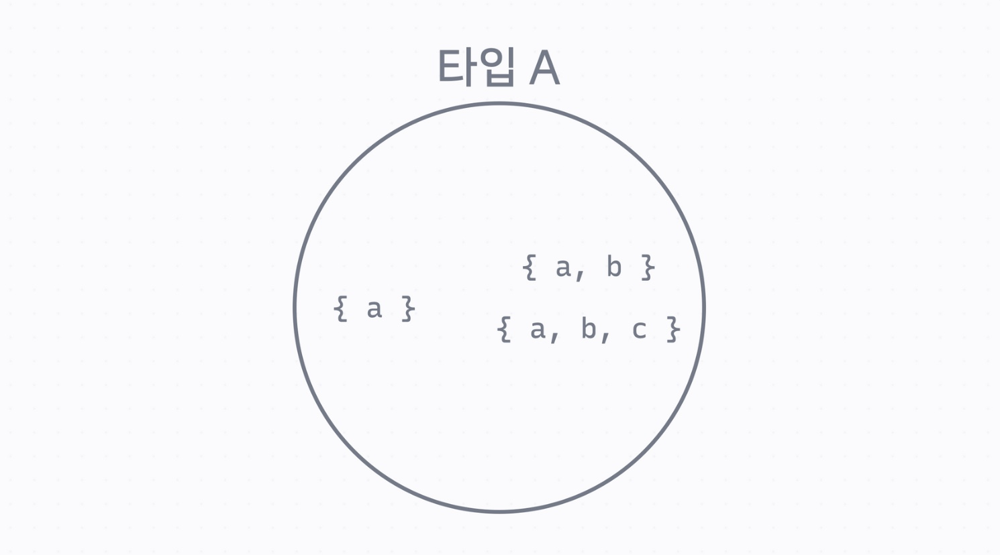

# TypeScript 기본기
# 기본 문법 정리

## 기본형

| **종류** | **타입** |
| --- | --- |
| **문자열** | **string** |
| **숫자형** | **number** |
| **불린형** | **boolean** |
| **undefined** | **undefined** |
| **null** | **null** |

## 배열과 튜플

- 배열 타입을 만들려면 타입을 적고 `[]` 를 붙입니다.
- 만약에 배열의 배열을 만들고 싶다면 배열 타입 뒤에 `[]` 을 붙이면 됩니다.
- 튜플은 개수랑 순서가 정해져 있는 배열입니다.
- `[]` 안에 순서대로 타입을 쉼표로 구분해서 씁니다.

```jsx
// 배열
const cart: string**[]** = [];
cart.push('c001');
cart.push('c002');

// 배열의 배열
const carts: string**[][]** = [
  ['c001', 'c002'],
  ['c003'],
];

// 튜플
let mySize: [number, number, string] = [175, 30, 'L'];
```

## 객체 타입

- `{}` 안에다가 프로퍼티 이름을 쓰고 콜론 다음에 타입을 씁니다.
- 각 프로퍼티는 세미콜론으로 구분합니다.
- **필수가 아닌 프로퍼티는 프로퍼티 이름 뒤에 물음표를 붙입니다.**

```jsx
let product: {
  id: string;
  name: string;
  price: number;
  membersOnly**?**: boolean; // 필수가 아닌 프로퍼티
  sizes: string[];
} = {
  id: 'c001',
  name: '코드잇 블랙 후디',
  price: 129000,
  sizes: ['M', 'L', 'XL'],
};

if (product.membersOnly) {
  console.log('회원 전용 상품');
} else {
  console.log('일반 상품');
}
```

## `any` 타입

- 자바스크립트를 사용할 때와 마찬가지로 자유롭게 쓸 수 있는 타입입니다.
- **되도록이면 `any` 타입으로 지정하지 않는 것을 권장합니다.**
- 어쩔 수 없이 `any` 타입을 사용하는 경우 `as` 키워드를 써서 타입을 지정하거나, 콜론으로 타입을 지정할 수 있습니다.

```jsx
const parsedProduct = JSON.parse('{ "name": "토트백", "price": 12000 }') as { name: string; price: number };
```

```jsx
const parsedProduct: { name: string; price: number } = JSON.parse('{ "name": "토트백", "price": 12000 }');
```

## 함수 타입

- 리턴 타입을 지정하는 경우에는 다음 코드처럼 작성하면 됩니다.

```jsx
function addToCart(id: string, quanity: number): boolean {
    if (어떤 조건) {
     return false;
  }

  return true;
}
```

- 리턴 타입을 미리 주지 않고 리턴 값으로부터 추론할 수도 있습니다.

```jsx
function addToCart(id: string, quanity: number) {
    if (어떤 조건) {
     return false;
  }

  return true;
}
```

- 함수를 값으로 사용하는 경우 화살표 함수처럼 작성합니다.

```jsx
(id: string, quanity: number) => boolean
```

- Rest 파라미터는 배열 타입으로 씁니다. 값을 리턴하지 않는 경우 리턴 타입을 `void` 로 할 수 있습니다.

```jsx
(...ids: string[]) => void;
```

# Enum 문법 정리

- 중괄호 안에서 각 항목을 쉼표로 구분해서 적어주면 됩니다.
- 이때 기본 값은 0부터 시작하는 정수입니다.

```jsx
enum Size {
  S,
  M,
  L,
  XL,
}

console.log(Size.S); // 0
console.log(Size.M); // 1
console.log(Size.L); // 2
```

- 숫자 0은 실수하기 쉽기 때문에 Enum 을 사용할 땐 되도록이면 값을 정해놓고 쓰는 게 좋습니다.
- 이퀄이랑 쉼표를 쓰면 값을 정할 수 있습니다.

```jsx
enum Size {
  S = 'S',
  M = 'M',
  L = 'L',
  XL = 'XL',
}
```

# Interface 문법 정리

- interface를 사용하는 방법은 `interface`  를 쓴 다음, 객체 타입처럼 만들면 됩니다.

```jsx
enum Size {
  S = 'S',
  M = 'M',
  L = 'L',
  XL = 'XL',
}

interface Product {
  id: string;
  name: string;
  price: number;
  membersOnly?: boolean;
}
```

- interface를 상속하고 싶으면 interface 이름 뒤에 `extends` 를 적은 다음 부모 interface 이름을 적어주면 됩니다.

```jsx

interface ClothingProduct extends Product {
  sizes: Size[];
}

const product1: ClothingProduct = {
  id: 'c001',
  name: '블랙 후드 집업',
  price: 129000,
  membersOnly: true,
  sizes: [Size.M, Size.L],
};

const product2: Product = {
  id: 'd001',
  name: '텀블러',
  price: 25000,
};
```

# Intersection하면 합쳐지는 이유

## Structural Subtyping

- 타입스크립트에서 타입은 Structural Subtyping이라는 규칙을 따릅니다.

   ⇒ 구조가 같으면 같은 타입이라고 판단합니다.

- 예를 들어 `a` 라는 프로퍼티를 갖는 타입 `A` 가 있다고 합니다.
- 이 타입의 `a` 프로퍼티를 출력하는 `printA()` 라는 함수가 있습니다.
- 이 함수를 아래 코드와 같이 `{ a: 'minseo' }` , `{ a: 'minseo' , b: 42 }` , `{ a: 'minseo' , b: 42, c: true }` 라는 객체로 실행해도 모두 올바른 타입입니다.

  ⇒ 세 객체 모두 `a` 라는 프로퍼티가 있기 때문에 타입 `A` 라고 판단합니다.

  ⇒ 이런 걸 Structural Subtyping, Structural Type System 이라고 부릅니다.

```jsx
interface A {
  a: string;
}

interface B {
  b: number;
}

function printA(arg: A) {
  console.log(arg.a);
}

const x = { a: 'codeit' };
const y = { b: 42 };
const z = { a: 'codeit', b: 42 };
const w = { a: 'codeit', b: 42, c: true };

printA(x);
printA(y); // 잘못된 타입
printA(z);
printA(w);
```

⇒ **같은 모양이 있으면 같은 타입이라고 판단합니다.**

<br>

- 원 안에 있는 것들은 타입 A에 해당하는 객체들입니다.



- 마찬가지로 타입 B까지 그림으로 표현하면 아래와 같이 표현할 수 있습니다.


## Union 타입 살펴보기

- 앞에서 Union 타입은 “A 타입이거나 B 타입이다” 라고 표현했습니다.
- 이걸 보다 정확하게 그림으로 이해해보면 아래와 같습니다.

  ⇒ `{ a: 'minseo' }` , `{ b: 42 }` 는 물론이고 

  ⇒ `{ a: 'minseo', b: 42 }` 도 

  ⇒ 타입 `A | B` 라고 사용할 수 있습니다.


- 코드로 확인해봐도 `printAUnionB()` 라는 함수에 모두 타입 오류 없이 사용할 수 있습니다.
- 함수 안에서 `if` 문으로 `in`  키워드를 사용해서 해당하는 프로퍼티가 존재하는지 확인했습니다.
- 이런식으로 타입의 범위를 좁힐 수도 있습니다.

  ⇒ 타입스크립트에서는 이런걸 Type Narrowing 이라고 표현합니다.

```jsx
interface A {
  a: string;
}

interface B {
  b: number;
}

function printAUnionB(arg: A | B) {
  // 여기서는 타입 A | B

    if ('a' in arg) {
    // 여기 안에서는 타입 A
    console.log(arg.a);
  }

    if ('b' in arg) {
    // 여기 안에서는 타입 B
    console.log(arg.b); // VS Code에서 arg에 마우스를 호버해 보세요.
  }
}

const x = { a: 'minseo' };
const y = { b: 42 };
const z = { a: 'minseo', b: 42 };
const w = { a: 'minseo', b: 42, c: true };

printAUnionB(x);
printAUnionB(y);
printAUnionB(z);
printAUnionB(w); 
```

## Intersection 타입 살펴보기

- 앞에서 `A & B` 라고 하면 “A와 B 두 타입을 합친다” 라고 간단히 표현했습니다.
- 이걸 보다 정확하게 그림으로 나타내보면 아래와 같습니다.
- `{ a, b }` 두 프로퍼티를 모두 가지고 있는 타입들은 `A & B`  라고 할 수 있습니다.


```jsx
interface A {
  a: string;
}

interface B {
  b: number;
}

function printAIntersectionB(arg: A & B) {
  console.log(arg.a);
  console.log(arg.b);
}

const x = { a: 'codeit' };
const y = { b: 42 };
const z = { a: 'codeit', b: 42 };
const w = { a: 'codeit', b: 42, c: true };

printAIntersectionB(x); // 타입 오류
printAIntersectionB(y); // 타입 오류
printAIntersectionB(z);
printAIntersectionB(w);
```

# 타입 별칭은 언제 쓰면 좋을까?

## Enum과 타입 별칭

- 아래 두 코드는 거의 같은 역할을 하는 코드입니다.

## Enum을 사용한 경우 (권장)

```jsx
enum UserType {
  Admin = 'admin',
  User = 'user',
  Guest = 'guest',
}

const role = UserType.Admin;
console.log(role === UserType.Guest);
```

## 타입 별칭과 Union을 사용한 경우

```jsx
type UserType = 'admin' | 'user' | 'guest'

const role: UserType = 'admin';
console.log(role === 'guest');
```

## JavaScript로 트랜스파일링 했을 때

- Enum 코드를 자바스크립트로 트랜스파일링해보면 아래와 같습니다.

```jsx
"use strict";
var UserType;
(function (UserType) {
    UserType["Admin"] = "admin";
    UserType["User"] = "user";
    UserType["Guest"] = "guest";
})(UserType || (UserType = {}));
const role = UserType.Admin;
console.log(role === UserType.Guest);
```

- Enum은 별도의 자바스크립트 객체를 만들어서 그 객체를 사용합니다.
- **`UserType`  은 자바스크립트에서 아래와 같은 객체입니다.**

```jsx
{ Admin: 'admin', User: 'user', Guest: 'guest' }
```

- 예를 들어서 가능한 `UserType`  값들을 모두 활용해서 어떤 동작을 구현하고 싶다면 Enum을 써서 `Object.keys()`  라는 함수를 사용할 수 있습니다.

```jsx
**console.log(Object.keys(UserType)); // ['Admin', 'User', 'Guest']**
```

- 반면에 타입 별칭은 타입스크립트에서만 의미 있는 코드입니다.
- 그래서 Enum과 달리 자바스크립트로 트랜스파일 했을 때 추가로 객체 같은 걸 만들지 않고 단순히 값만 사용하는 코드가 만들어집니다.

```jsx
"use strict";
const role = 'admin';
console.log(role === 'guest');
```

## 어떤 걸 써야 할까?

- 대부분의 경우 Enum 또는 타입 별칭 모두 사용할 수 있습니다.
- 하지만 되도록 Enum의 목적에 맞는 경우라면 Enum 문법을 사용하는걸 권장합니다.

# Interface 타입 별칭

- 아래 두 코드는 거의 같은 역할을 하는 코드입니다.

## Interface를 사용한 경우 (권장)

```jsx
interface Entity {
  id: string;
  createdAt: Date;
  updatedAt: Date;
}

interface User extends Entity {
  username: string;
  email: string;
}
```

## 타입 별칭을 사용한 경우

```jsx
type Entity = {
  id: string;
  createdAt: Date;
  updatedAt: Date;
}

type User = Entity & {
  username: string;
  email: string;
}
```

- Interface의 상속과 Intersection의 가장 큰 차이점은
- Intersection은 두 가지 이상의 타입을 한 번에 합칠 수 있습니다.

```jsx
interface Entity {
  id: string;
}

interface TimestampEntity extends Entity {
  createdAt: Date;
  updatedAt: Date;
}

interface User extends TimestampEntity {
  username: string;
  email: string;
}
```

```jsx
type Id = {
  id: string;
}

type Entity = {
  createdAt: Date;
  updatedAt: Date;
}

type User = Id & Entity & {
  username: string;
  email: string;
}
```

## 어떤 걸 써야 할까?

- 대부분의 경우 Interface와 타입 별칭을 둘 다 사용할 수 있습니다.
- 하지만 되도록 Interface의 목적에 맞는 경우라면 Interface를 사용하는 걸 권장합니다.

## 타입 별칭은 언제 쓰면 좋을까?

- 타입 별칭은 타입에 ‘이름’을 정하는 문법입니다.
- 복잡한 타입을 만들고, 그 타입을 여러 곳에서 활용할 때 사용하면 됩니다.
- 예를 들면 아래처럼 복잡한 타입을 만들고 여러 곳에서 재활용할 수 있습니다.

```jsx
type Point = [number, number];
type SearchQuery = string | string[];
type Result = SuccessResult | FailedResult;
type Coupon = 
  | PromotionCoupon
  | EmployeeCoupon
  | WelcomCoupon
  | RewardCoupon
  ;
```

# 타입들 문법 정리

## 리터럴 타입

- 특정한 숫자나 문자열 같이 변수의 값을 타입으로 하는 타입입니다.
- 각 리터럴 타입들은 `string`  이나 `number` 같은 더 큰 타입에 포함됩니다.

```jsx
const name = 'minseo'; // 'minseo' 이라는 리터럴 타입
const rank = 1; // 1 이라는 리터럴 타입
```

## 타입 별칭

- 복잡한 타입에 이름을 붙이고 재사용하고 싶을 때 사용합니다.

```jsx
type Point = [number, number];
type SearchQuery = string | string[];
type Result = SuccessResult | FailedResult;
type Coupon = 
  | PromotionCoupon
  | EmployeeCoupon
  | WelcomCoupon
  | RewardCoupon
  ;   
```

## Union

- `A` 이거나 또는 `B` 인 경우를 타입으로 만들고 싶을 때

```jsx
ClothingProduct | ShoeProduct
```

## Intersection

- `A` 와 `B`  의 성질을 모두 갖는 타입을 만들고 싶을 때

```jsx
interface Entity {
  id: string;
  createdAt: Date;
  updatedAt: Date;
}

type Product = Entity & {
  name: string;
  price: number;
  membersOnly?: boolean;
}
```

- 하지만 보통 이럴 때는 `interface` 와 상속을 사용하는게 좋습니다.

```jsx
interface Entity {
  id: string;
  createdAt: Date;
  updatedAt: Date;
}

interface Product extends Entity {
  name: string;
  price: number;
  membersOnly?: boolean;
}
```

## `keyof`  연산자

- 객체 타입에서 프로퍼티 이름들을 모아서 Union한 타입으로 만들고 싶을 때 사용합니다.

```jsx
interface Product {
  id: string;
  name: string;
  price: number;
  membersOnly?: boolean;
}

type ProductProperty = keyof Product; // 'id' | 'name' | 'price' | 'membersOnly';
```

## `typeof`  연산자

- 자바스크립트 코드에서 사용하면 결괏값이 문자열이지만, 타입스크립트 코드에서 쓸 때는 결과 값은 타입스크립트의 타입입니다.

```jsx
const product: Product = {
  id: 'c001',
  name: '김민서의 블랙 후드 집업',
  price: 129000,
  salePrice: 98000,
  membersOnly: true,
};

console.log(typeof product); // 문자열 'object'

const product2: typeof product = { // 타입스크립트의 Product 타입
  id: 'g001',
  name: '김민서의 텀블러',
  price: 25000,
  salePrice: 19000,
  membersOnly: false,
};
```

# 알아두면 유용한 제네릭 타입들

## JavaScript 기능들

### `querySelector()`  함수

- 기본적으로 어떤 DOM 노드가 리턴될지 모르기 때문에 `HTMLElement` 라는 일반적인 타입으로 정의됩니다.
- 하지만 타입을 확신할 수 있는 경우에는 아래 코드처럼 직접 제네릭 타입을 정의해 주면 됩니다.

```jsx
const elem = document.querySelector<HTMLInputElement>('input.username');
```

## `Map`

- 키와 밸류를 갖는 자료구조입니다. 타입 파라미터로 키와 밸류의 타입을 정의하고 사용할 수 있습니다.

```jsx
const productMap = new Map<string, Product>();
productMap.set(product1.id, product1);
productMap.set(product2.id, product2);
```

## `Set`

- 배열과 비슷하지만 중복된 요소를 추가할 수 없는, 수학에서 집합에 해당하는 자료구조입니다.
- 타입 파라미터로 요소의 타입을 정의하고 사용할 수 있습니다.

```jsx
const productSet = new Set<Product>();
productSet.add(product1);
productSet.add(product2);
```

## 유용한 타입들

## 키와 밸류 정하기 : `Record`

- 객체에 키와 밸류 타입을 정해놓고 싶을 때 사용합니다.
- `Map` 과 비슷하지만 차이점은 순수한 객체에 타입만 추가한다는 점입니다.

```jsx
const productMap: Record<string, Product> = {}
productMap['c001'] = product1;
productMap['c002'] = product2;
```

## 객체 프로퍼티 고르기 : `Pick`

```jsx
interface Product {
  id: string;
  name: string;
  price: number;
  membersOnly?: boolean;
}

type ProductInfo = Pick<Product, 'name' | 'price'>;
```

- `Pick`  으로 만든 타입은 아래와 같습니다. `name` 프로퍼티와 `price` 프로퍼티만 골라서 타입을 만들었습니다.

```jsx
type ProductInfo = {
    name: string;
    price: number;
} 
```

## 객체의 프로퍼티 생략하기 : `Omit`

```jsx
interface Product {
  id: string;
  name: string;
  price: number;
  membersOnly?: boolean;
}

type ProductInfo = Omit<Product, 'id' | 'membersOnly'>;
```

- `Omit` 으로 만든 타입은 아래와 같습니다. `id` 와 `memberOnly`  를 제외하고 타입을 만들었습니다.

```jsx
type ProductInfo = {
    name: string;
    price: number;
} 
```

## Union 제거하기 : `Exclude`

- Union을 사용해서 `PromotionCoupon`  또는 `EmployeeCoupon`  또는 `WelcomCoupon`  또는 `RewardCoupon`  인 타입을 `Coupon`  이라고 했습니다.
- 여기서 `EmployCoupon`  에 해당하는 것만 제거를 하고 싶을 때 `Exclude` 를 사용할 수 있습니다.

```jsx
type Coupon = 
  | PromotionCoupon
  | EmployeeCoupon
  | WelcomCoupon
  | RewardCoupon
  ;

type InternalCoupon = EmployeeCoupon;
type PublicCoupon = Exclude<Coupon, InternalCoupon>;
// type PublicCoupon = PromotionCoupon | WelcomCoupon | RewardCoupon
```

## 함수 파라미터 타입 가져오기 : `Parameters`

- 함수 파라미터들의 타입을 함수의 타입을 통해 정의할 수 있습니다.
- 만약 함수의 타입이 아니라, 선언된 함수라면 `typeof` 연산자로 함수의 타입으로 만들어서 사용하면 됩니다.

```jsx
function addToCart(id: string, quantity: number = 1): boolean {
  // ...
  return true;
}

type AddToCartParameters = Parameters<typeof addToCart>;
// type AddToCartParameters = [id: string, quantity: number | undefined]
```

## 함수 리턴 타입 가져오기: `ReturnType`

- `Parameters` 와 마찬가지로 함수의 리턴 타입을 가져옵니다.

```jsx
function addToCart(id: string, quantity: number = 1): boolean {
  // ...
  return true;
}

type AddToCartResult = ReturnType<typeof addToCart>;
// type AddToCartResult = boolean
```

# `tsconfig.json` 자주 사용하는 옵션

- 프로젝트를 만들 때 `tsc --init` 명령어로 `tsconfig.json` 파일을 생성했습니다.

```jsx
{
  "compilerOptions": {
    "target": "es2016",                                  /* Set the JavaScript language version for emitted JavaScript and include compatible library declarations. */
    "module": "commonjs",                                /* Specify what module code is generated. */
    "esModuleInterop": true,                             /* Emit additional JavaScript to ease support for importing CommonJS modules. This enables 'allowSyntheticDefaultImports' for type compatibility. */
    "forceConsistentCasingInFileNames": true,            /* Ensure that casing is correct in imports. */
    "strict": true,                                      /* Enable all strict type-checking options. */
    "skipLibCheck": true                                 /* Skip type checking all .d.ts files. */
  }
}
```

## 꼭 알아야 할 컴파일러 옵션들

## `compilerOptions` 에서 사용할 수 있는 옵션 중에서 중요한 것들

### 1. `target` : 어떤 ECMAScript 버전으로 변환할지

- 타입스크립트 코드는 빌드해서 자바스크립트로 변환합니다.

  ⇒ 이때 변환할 자바스크립트의 버전을 정할 수 있습니다.

- 만약에 프로젝트가 과거 자바스크립트 표준만 지원하는 브라우저까지 지원해야 한다면, 여기서 오래된 버전을 설정할 수 있습니다.
- 코드를 실행할 브라우저나 Node.js 환경에 따라 선택하면 됩니다.
- 브라우저의 경우 ES5는 거의 모든 브라우저에서 지원하고, ES6는 인터넷 익스플로러를 제외하면 대부분의 브라우저에서 지원합니다.

  ⇒ 일단은 ES6로 설정해 두고 쓰는 걸 추천합니다.

### 2. `module`  : 어떤 방식으로 모듈을 만들지

- 자바스크립트 모듈에는 크게 두 가지 방식이 있습니다.
    - ES6부터 도입된 `import/export` 문법을 사용하는 **ESM(ECMAScript Module)** 방식
    - Node.js 같은 데서 기본적으로 사용하는 **CJS(CommonJS)** 방식
- 이 옵션에서는 자바스크립트 코드로 트랜스파일할 때 어떤 모듈 문법으로 변환할지 선택할 수 있습니다.
- 다양한 옵션 값을 지원합니다.
    - ESM 을 쓰려면 ⇒ `es6` , `es2020` 같이 `es` 로 시작하는 값을 쓰면 됩니다.
    - CJS 를 쓰려면 ⇒ `commonjs`  라고 쓰면 됩니다.
- 보통 Node.js 환경에서는 CJS 를 사용하고 , 프론트엔드 개발을 할 때는 보통 번들러에서 모듈을 알아서 처리해주기 때문에 ESM, CJS 상관없이 쓸 수 있습니다.

  ⇒ 어떤 걸 선택할지 잘 모르겠다면 `commonjs` 로 설정합니다.

## 3. `esModuleInterop` : ES 모듈을 안전하게 사용

- ESM 문법에서 `import * as moment from 'moment'` 라든가 `import moment from 'moment'` 라는 문법은 서로 다릅니다.
- 이 옵션을 `false` 로 하면 CJS로 변환했을때 두 코드는 같은 형태의 코드 `const moment = require('moment')` 로 변환됩니다.

  ⇒ 안전하게 모듈을 사용하려면 `esModuleInterop` 옵션은 `true` 로 해놓는게 좋습니다.

- https://www.typescriptlang.org/tsconfig/#esModuleInterop

## 4. `forceConsistentCasingInFileNames` : 파일의 대소문자 구분하기

- macOS 를 사용하면 `main.ts` 라는 파일과 `Main.ts` 라는 파일이 서로 다릅니다.
- 종종 `main.ts` 라는 파일과 `Main.ts` 라는 파일을 동일하게 취급하기도 합니다.

  ⇒ 이런 환경에서 개발하더라도 반드시 대소문자 구분을 명확하게 하겠다는 옵션입니다.
  ⇒ 이 옵션도 반드시 `true` 로 해놓는 걸 권장드립니다.

## 5. `strict` : 엄격한 규칙들 켜기

- 이 옵션을 켜면 `strict` 와 관련된 여러 규칙들을 한꺼번에 켤 수 있습니다.
- 어떤 옵션들이 켜지는지는  https://www.typescriptlang.org/tsconfig/#strict 를 참고하면 됩니다.
- 여기서는 그 중에서도 대표적으로 알아두면 좋은 것 두 가지가 있습니다.
    - `noImplicitAny` : 아무 타입을 직접 정의하지 않고, 타입 추론도 되지 않는 상태를 implicit any 라고 합니다.
    - 쉽게 말해서 기존 자바스크립트 코드처럼 타입 없이 사용하는 걸 implicit any 라고 합니다.
    
    ```jsx
    function printSize(product) {
                       ~~~~~~~ 타입 정의도 없고 추론할 수도 없음
      console.log(product.size);
    }
    ```
    

- 새로 시작하는 타입스크립트 프로젝트라면 무조건 켜는 걸 추천드리지만, 기존에 자바스크립트로 만든 프로젝트를 타입스크립트로 옮기는 중이라면 이 옵션을 잠시 끄는 것도 좋습니다.
- 아래처럼 설정하면 `strict`  규칙들을 한꺼번에 설정하지만 `noImplicitAny` 는 설정하지 않을 수 있습니다.

```jsx
"strict": true,
"noImplicitAny": false,
```

- `strictNullChecks` : `null` 이 될 가능성이 있다면, 이런 경우를 반드시 처리하도록 하는 옵션입니다.
- 이것도 되도록이면 켜 놓으시는 걸 추천합니다.
- 예를 들자면 아래와 같은 코드는 strict null check를 할 때는 오류가 납니다.
- `num` 변수가 `null` 이 될 수도 있으니까요.
- 반면에 `strictNullChecks` 가 꺼져있다면 타입 오류가 나지 않습니다.
- 대신에 실행하는 도중에 `num`  변수에 `null`  값이 들어간다면 런타임 오류가 납니다.

```jsx
let num: number | null;
// ...
num -= 1;
~~~
```

- 되도록이면 `strictNullChecks` 를 켜고, 이런 경우에는 반드시 null check를 하는 걸 권장합니다.

```jsx
let num: number | null;
// ...
if (num !== null) {
  num -= 1;
}
```

## 6. `skipLibCheck` : 설치한 패키지의 타입 검사하지 않기

- `nod_modules` 폴더에 설치된 패키지들의 타입 검사를 하지 않는 옵션입니다.
- 패키지 개발 과정에서 대부분 타입 검사가 이뤄지기 때문에, 중복으로 하지 않아도 됩니다.

  ⇒ 이 옵션은 가능한 사용하는걸 추천합니다.

## 7.  `rootDir` : 최상위 폴더

- 타입스크립트 컴파일러가 처리할 타입스크립트 파일들의 최상위 폴더를 정하는 옵션입니다.
- 기본 값으로는 처리하는 파일들의 경로를 종합해서 최상위 폴더를 정합니다.
- 만약 `tsconfig.json`  파일과 같은 폴더에 있는 `src`  폴더를 최상위 폴더로 정하고 싶다면 아래와 같이 쓰면 됩니다.

```jsx
{  
  "compilerOptions": {
    **"rootDir": "src"**,
  }
}
```

## 8. `outDir` : 자바스크립트 파일을 생성할 폴더

- `outDir`  에 지정된 폴더 안에다가 `rootDir` 의 디렉토리 구조에 따라서 자바스크립트 파일을 만듭니다.
- 값을 지정하지 않으면 소스코드 파일과 같은 폴더에 자바스크립트 파일을 만듭니다.

```jsx
{  
  "compilerOptions": {
    **"outDir": "dist"**,
  }
}
```

## 9. `resolveJsonModule`  : JSON 파일 임포트하기

- `.json` 파일을 임포트해서 사용하고 싶다면 이 옵션을 켜야 합니다.

```jsx
import data from 'data.json';
// ...
```

## 10. `include` 와 `exclude`

- `tsc` 로 트랜스파일할 때 포함할 경로 ( `include` ) 와 포함하지 않을 경우 ( `exclude` ) 를 정해줄 수 있습니다.
- 배열로 경로 패턴을 적어주면 됩니다.
- `**/*`  라는 코드는 아래의 모든 폴더, 모든 파일을 의미합니다.

  ⇒ 이런 패턴을 **Glob** 패턴이라고 합니다.

https://ko.wikipedia.org/wiki/%EA%B8%80%EB%A1%9C%EB%B8%8C_(%ED%94%84%EB%A1%9C%EA%B7%B8%EB%9E%98%EB%B0%8D)

```jsx
{
  "compilerOptions": {
    "target": "es2016",                                  /* Set the JavaScript language version for emitted JavaScript and include compatible library declarations. */
    "module": "commonjs",                                /* Specify what module code is generated. */
    "esModuleInterop": true,                             /* Emit additional JavaScript to ease support for importing CommonJS modules. This enables 'allowSyntheticDefaultImports' for type compatibility. */
    "forceConsistentCasingInFileNames": true,            /* Ensure that casing is correct in imports. */
    "strict": true,                                      /* Enable all strict type-checking options. */
    "skipLibCheck": true                                 /* Skip type checking all .d.ts files. */
  }
  "include": ["src/**/*", "tests/**/*"],
  "exclude": ["bin/**/*"],
}
```

## 그 밖의 옵션들 활용하기

- 옵션이 너무 많기 때문에 모든 옵션들을 전부 알고 있을 필요는 없습니다.
- 그 밖의 다른 옵션들이 궁금하면 https://www.typescriptlang.org/tsconfig/ 를 참고하면 됩니다.
- VS Code에서는 옵션들을 자동완성 기능으로 작성할 수 있습니다.
    - 무엇을 작성해야 할지 모를 때 Window에서는 `Ctrl`  + `I` , macOS 에서는 `Cmd`  + `I` 를 입력하면 suggestion이 뜹니다.

# `tsconfig.json`  파일 불러오기

- `tsconfig.json`  파일을 매번 설정하는 건 귀찮기도 하고, 만약에 여러 프로젝트를 개발한다면 항상 똑같은 설정을 쓰고 싶습니다.
- 이럴 때 매번 복사 / 붙여넣기 하는 건 유지 보수하는데 좋지 않습니다.
- 이럴 때 사용할 수 있는 옵션이 바로 `extends`  입니다.

  ⇒ 아래와 같이 `extends` 옵션으로 원하는 설정 파일의 경로를 적어주면 `tsconfig.json`  파일을 불러올 수 있습니다.

`tsconfig.json`

```jsx
{
  "extends": "<설정 파일 경로>"
}
```

## tsconfig/bases 예시

- 예를 들어서 권장하는 `tsconfig.json`  설정들을 모아놓은 https://github.com/tsconfig/bases 리포지토리에 있는 설정 파일을 패키지로 설치한 다음, 불러와서 사용하면 됩니다.

## 패키지 설치하기

- 타입스크립트 패키지는 개발 환경에서만 사용하기 때문에, `--save-dev`  옵션으로 설치합니다.

```jsx
npm install --save-dev @tsconfig/recommended
```

## `extends` 설정하기

- `tsconfig.json`  파일의 맨 위에 `extends` 속성을 추가해 줍니다.

`tsconfig.json`

```jsx
{
  "extends": "@tsconfig/recommended/tsconfig.json",
  "compilerOptions": {
  }
}
```

## 옵션 덮어쓰기

- https://github.com/tsconfig/bases/blob/main/bases/recommended.json 파일을 살펴보니까 아래와 같은 옵션을 사용하고 있습니다.

`base/recommended.json`

```jsx
{
  "compilerOptions": {
    "target": "ES2015",
    "module": "commonjs",
    "strict": true,
    "esModuleInterop": true,
    "skipLibCheck": true,
    "forceConsistentCasingInFileNames": true
  },
  "$schema": "https://json.schemastore.org/tsconfig",
  "display": "Recommended"
}
```

- `target` 을 `ES2016`  으로 사용하고 싶으면 이 옵션을 덮어씁니다.

`tsconfig.json`

```jsx
{
  "extends": "@tsconfig/recommended/tsconfig.json",
  "compilerOptions": {
    "target": "ES2016"
  }
}
```

- 이런 식으로 `extends`  옵션을 사용하면 패키지로 설치한 `tsconfig.json`  파일을 불러올 수도 있고, 직접 만든 `tsconfig.json`  파일을 불러올 수도 있습니다.

