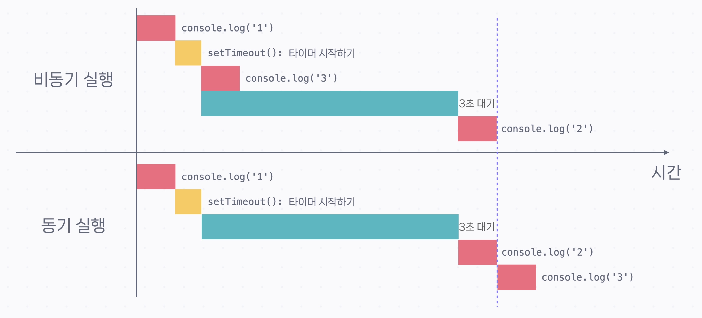
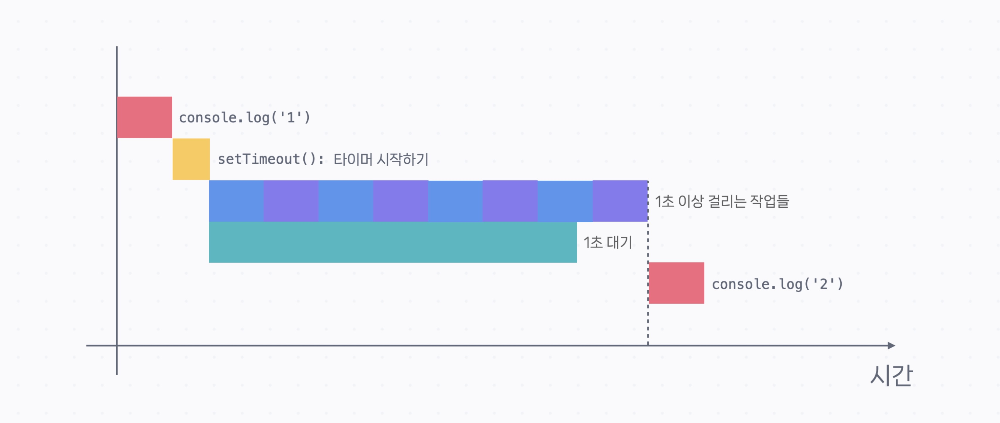
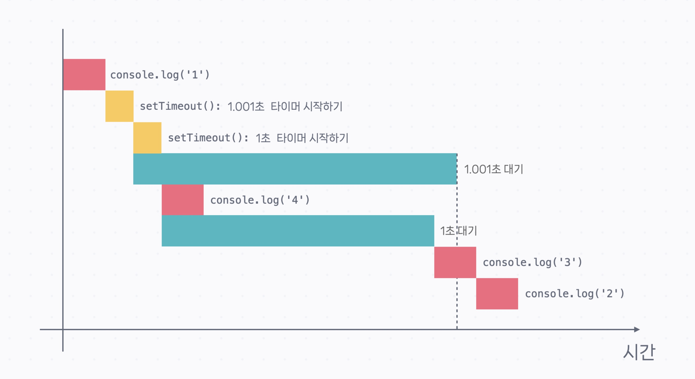
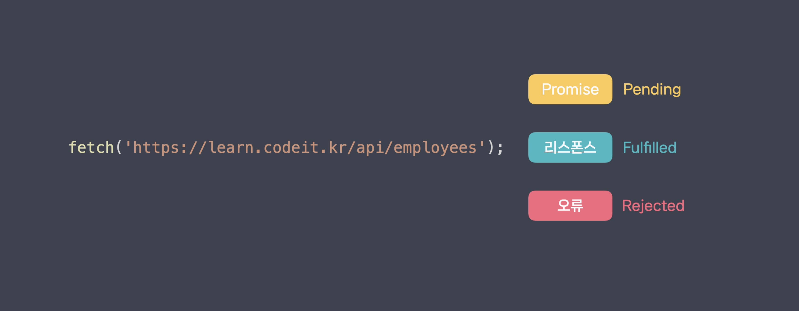

# 비동기 자바스크립트

# 콜백 정리

## 콜백(Callback)이란?

- 어떤 함수의 아규먼트로 전달되는 함수를 **콜백** 또는 **콜백 함수**라고 부릅니다. 문법은 아래와 같습니다.

## function 키워드로 선언한 함수를 콜백으로 사용(콜백 파라미터 없음)

```jsx
function printMessage(func) {
  console.log('Printing message...');
  func();
}

function sayHello() {
  console.log('Hello World!');
}

printMessage(sayHello);
```

```jsx
Printing message...
Hello World!
```

## Arrow Function을 콜백으로 사용(콜백 파라미터 없음)

```jsx
function printMessage(func) {
  console.log('Printing message...');
  func();
}

printMessage(() => console.log('Hello World!'));
```

```jsx
Printing message...
Hello World!
```

## function 키워드로 선언한 함수를 콜백으로 사용(콜백 파라미터 있음)

```jsx
function printMessageWithParams(func, name) {
  console.log('Printing message...');
  func(name);
}

function sayHello(name) {
  console.log(`Hello ${name}!`);
}

printMessageWithParams(sayHello, 'Bob');
```

```jsx
Printing message...
Hello Bob!
```

## Arrow Function을 콜백으로 사용(콜백 파라미터 있음)

```jsx
function printMessageWithParams(func, name) {
  console.log('Printing message...');
  func(name);
}

printMessageWithParams((name) => console.log(`Hello ${name}!`), 'Bob');
```

```jsx
Printing message...
Hello Bob!
```

## 콜백과 비동기 함수

- `setTimeout()` 함수는 특정 시간이 지난 후에 콜백을 실행하는 함수입니다.
- 기다리는 동안에는 함수 아래에 있는 코드를 실행합니다.

```jsx
console.log('1');

setTimeout(() => console.log('2'), 3000);

console.log('3');
```

```jsx
1
3
2
```



- `setTimeout()` 함수는 내용을 끝까지 다 실행하지 않고 중간에 다른 코드를 실행하다가 다시 함수 안으로 돌아옵니다.

 ⇒ 이런 함수를 **비동기 함수**라고 부릅니다.

- 콜백을 이용하면 나중에 할 작업을 함수 형태로 전달해줄 수 있기 때문에 비동기 함수에 많이 쓰입니다.

## 콜백의 한계점

- 여러 비동기 작업을 연속적으로 처리할 때는 한계점이 있습니다.

```jsx
// 직원 데이터를 가져온 후 리스폰스를 파싱하고 데이터를 프로세싱 하는 예시
getEmployees((response) => {
  json(response, (data) => {
    groupEmployees(data, (result) => {
      console.log(result);
    });
  });
});
```

- 콜백 기반 코드는 모든 작업을 함수 안에서 처리하기 때문에 작업을 이어서 하려면 콜백 안에 콜백을 등록해야 합니다.

 ⇒ 콜백을 중첩해서 사용해야 하고, 이러한 현상을 **콜백 헬(Callback Hell)**이라고 부릅니다.

: 코드를 이해하기도 힘들고, 디버깅이나 테스팅 같은 걸 하기도 어려운 현상이 발생

 ⇒ `Promise` 등장

- 모든 상황에 `Promise` 기반 코드가 더 좋고, 모든 비동기 작업은 `Promise` 로 처리하는 것은 아닙니다.

 ⇒ `Promise` 는 **비동기 코드의 결과값을 활용해야 할 때** 특히 유용하고 이런 경우가 아니라면 여전히 콜백을 사용합니다.


<br><br>


# 비동기 실행 파헤치기

## 비동기 함수는 이후에 있는 코드를 모두 실행하고 콜백을 실행한다.

```jsx
console.log('1');

setTimeout(() => console.log('2'), 0);

console.log('3');
console.log('4');
console.log('5');
console.log('6');
console.log('7');
console.log('8');
console.log('9');
console.log('10');
```

- `setTimeout()` 함수의 두 번째 파라미터로 `0` 을 넘겨줬는데요.

 ⇒ 콜백을 바로 실행하라는 뜻입니다. 하지만 위 코드를 실행해보면 아래와 같은 결과가 나옵니다.

```jsx
1
3
4
5
6
7
8
9
10
2
```

- `setTimeout(() => console.log('2'), 0);` 아래 있는 코드들이 먼저 실행되고 콜백이 실행됐습니다.
- 비동기 함수의 콜백은, 아무리 빨리 실행돼도 **비동기 함수 이후에 있는 코드가 모두 실행된 후에 실행**됩니다.
- 반대로 생각하면, 비동기 함수 이후에 있는 코드가 굉장히 오래 걸려도, 그걸 모두 실행하고 콜백을 실행합니다.

- 예를 들어 아래와 같은 코드를 실행해도 `console.log('2')` 는 가장 마지막에 실행됩니다.

```jsx
console.log('1');

setTimeout(() => console.log('2'), 1000);

// 1초 이상 걸리는 작업들
```



- 하지만 대부분의 경우 비동기 함수 이후에 코드가 아무리 많다고 해도 비동기 작업이 훨씬 오래 걸립니다.

## 실행할 콜백이 여러 개일 경우, 동기적으로 실행된다.

```jsx
console.log('1');

setTimeout(() => console.log('2'), 1001);

setTimeout(() => console.log('3'), 1000);

console.log('4');
```



- 두 번째 `setTimeout()` 의 콜백이 실행되는 동안 첫 번째 `setTimeout()` 의 타이머가 끝납니다.

 ⇒ 콜백은 동기적으로(순차적으로) 실행됩니다.

## 비동기 함수

## `setTimeout()` 함수

```jsx
// ...

setTimeout(callback, delay);

// ...
```

- 함수의 동작은 아래와 같습니다.
1. `setTimeout()` 이전에 있는 코드 실행
2. `setTimeout()` 함수 실행: `delay` 만큼 기다리는 타이머를 시작
3. `setTimeout()` 이후에 있는 코드 실행
4. `delay` 가 지나면 `callback` 실행

## `setInterval()`  함수

- `setTimeout()` 와 비슷한 `setInterval()` 함수입니다.
- `setInterval()` 함수는 시간 간격을 두고 콜백을 반복적으로 실행합니다.

```jsx
console.log('Start');

// setInterval(callback, interval): interval 단위는 밀리초입니다.
setInterval(() => console.log('2초가 지났습니다'), 2000);

console.log('End');
```

```jsx
Start
End
2초가 지났습니다
2초가 지났습니다
2초가 지났습니다
2초가 지났습니다
...
```

- ( `callback` 은 `interval` 이 지난 후 처음으로 실행됩니다.)

- 만약 콜백이 호출되는 것을 멈추고 싶다면 `setInterval()` 함수의 리턴값을 저장해 놨다가 `clearInterval()` 을 실행하면 됩니다.

```jsx
console.log('Start');

const intervalID = setInterval(() => console.log('2초가 지났습니다'), 2000);

// 7초 후에 setInterval() 해제
setTimeout(() => clearInterval(intervalID), 7000);

console.log('End');
```

```jsx
Start
End
2초가 지났습니다
2초가 지났습니다
2초가 지났습니다
```

- `2초가 지났습니다` 를 2초마다 출력하지만
- 7초 후에 `clearInterval()` 함수가 `setInterval()` 함수를 해제하기 때문에
- `2초가 지났습니다` 는 세 번만 출력됩니다.

## DOM의 `addEventListener()` 함수

- `addEventListener()` 는 웹 페이지 요소에 상호 작용이 있을 경우 실행할 함수를 등록합니다.

```jsx
const btn = document.querySelector('.my-btn');

btn.addEventListener('click', () => console.log('button clicked!'));

// ...
```

- 자바스크립트로는 웹 페이지의 요소(예: 버튼, 이미지, 문단 등)를 코드로 가져올 수 있습니다.
- 첫 번째 줄에서는 `my-btn` 클래스를 가진 버튼 요소를 찾아서 `btn` 이라는 변수에 저장합니다.
- 두 번째 줄은, `btn` 에 클릭 ( `'click'` ) 이벤트가 발생할 시 `() => console.log('button clicked!')` 콜백이 실행되도록 해 줍니다.
- `btn.addEventListener()` 아래에 있는 코드를 실행하다가 사용자가 `btn` 요소를 클릭하면 콜백이 실행돼서 `'button clicked!'` 라고 콘솔에 출력됩니다.

## React의 `useEffect()`  함수

```jsx
function PostList() {
  // ...

  useEffect(() => console.log('render finished!'), []);

  return (
    <div className="post-list">
      <div className="post-item">...</div>
      <div className="post-item">...</div>
      <div className="post-item">...</div>
      ...
    </div>
  );
}
```

- React에서는 웹사이트 화면을 컴포넌트 (Compnent) 단위로 분리해서 만듭니다.
- 위에서 정의한 `PostList()` 는 어떤 웹사이트 포스팅 목록에 해당하는 컴포넌트입니다.
- 안에 `useEffect()` 라는 비동기 함수가 있습니다.

 ⇒ 컴포넌트가 모두 화면에 그려지는 시점에 콜백을 실행해 줍니다.

 ⇒ 작업이 완료되고 나면 `useEffect()` 에 등록된 콜백이 실행되고 `render finished!` 라는 메세지가 출력됩니다.


<br><br>

# Promise 정리

## Promise란?

- Promise는 비동기 작업이 완료되면 값을 알려주는 객체입니다. 세 가지 상태를 가집니다.
1. `Pending` : 비동기 작업이 끝나기를 기다릴 때
2. `Fulfilled` : 비동기 작업이 성공적으로 끝났을 때. 비동기 작업의 성공 결과를 결과값으로 갖게 됨.
3. `Rejected` : 비동기 작업이 실패했을 때. 비동기 작업에서 발생한 오류를 결과값으로 갖게 됨.



- Promise 객체를 통해 비동기 작업의 결과를 가져오거나 오류를 적절히 처리할 수 있습니다.
- Promise 객체를 다루는 방법은 두 가지가 있습니다.

## `async` , `await` 문법

```jsx
const result = await Promise;

// 예시
const response = await fetch('https://learn.codeit.kr/api/employees');
```

**Promise 객체 앞에 `await` 키워드를 쓰면 Promise의 상태가 fulfilled 또는 rejected가 될 때까지 기다립니다.**

- Fulfilled가 되면 Promise 객체의 결괏값을 리턴합니다.
- Rejected가 되면 Promise 객체의 결괏값(오류)을 throw합니다.

**Promise 객체의 값을 가져오려면 항상 앞에 `await` 을 붙여야 합니다.**

- `await` 은 보통 `async` 함수 안에서 사용합니다. ES 모듈의 경우 함수 바깥에서도 사용할 수 있습니다.

```jsx
// 일반 function
async function printEmployees() {
  const response = await fetch('https://learn.codeit.kr/api/employees');
  const data = await response.json();
  console.log(data);
}

// Arrow function
const printEmployees = async () => {
  const response = await fetch('https://learn.codeit.kr/api/employees');
  const data = await response.json();
  console.log(data);
}
```

- **`async` 함수는 안에서 `await` 을 마주치면, 함수 바깥으로 나가서 나머지 코드를 실행하다가 Promise 객체가 fulfilled 또는 rejected 상태가 되면 다시 함수 안으로 돌아와서 코드를 실행합니다.**

```jsx
async function printEmployees() {
  const response = await fetch('https://learn.codeit.kr/api/employees');
  const data = await response.json();
  console.log(data);
}

printEmployees();

console.log('Task 2');
console.log('Task 3');
```

```jsx
Task 2
Task 3
[
  {
    id: 1,
    name: 'Jason',
    email: 'jason@codeitmall.kr',
    department: 'engineering'
  },
  ...
]
```

**`async` 함수는 항상 Promise를 리턴합니다.**

- 함수 안에서 Promise를 리턴하면 그 Promise를 그대로 리턴합니다.
- 함수 안에서 평범한 값을 리턴하면 그 값을 결괏값으로 갖는 Promise를 리턴합니다.

### 따라서 `async` 함수에서 리턴하는 값을 가져오려면 `await` 을 활용해야 합니다.

```jsx
async function getEmployees() {
  const response = await fetch('https://learn.codeit.kr/api/employees');
  const data = await response.json();
  return data;
}

const employees = await getEmployees(); // await을 생략하면 employees에 **Promise 객체**가 할당됩니다.
```

## 오류 처리

- `try` , `catch` 를 이용해서 오류를 처리할 수 있습니다.

```jsx
async function printEmployees() {
  try {
    const response = await fetch('https://learn.codeit.krrrrr/api/employees');
    const data = await response.json();
    console.log(data);
  } catch (error) {
    console.log('error!');
  }
}
```

- 오류가 발생할 만한 코드를 `try` 로 감싸 주고, `catch` 안에서 오류를 처리하면 됩니다.
- 발생한 오류는 `catch` 문의 `error` 변수에 전달되기 때문에 이걸 활용할 수도 있습니다.
- 만약 `try` , `catch` 문의 결과와 상관없이 끝에 항상 실행해야 하는 코드가 있다면 `finally` 문을 사용하면 됩니다.

```jsx
async function printEmployees() {
  try {
    const response = await fetch('https://learn.codeit.krrrrr/api/employees');
    const data = await response.json();
    console.log(data);
  } catch (error) {
    console.log('error!');
    return;
  } finally {
    console.log('finished');
  }
}
```

- 위 코드에서는 오류가 발생해서 `catch` 문에서 `return` 을 해도 `console.log('finished')` 는 실행됩니다.

## `.then()` 메소드

- `.then()` 은 Promise 객체의 메소드입니다.

```jsx
fetch('https://learn.codeit.kr/api/employees')
  .then((response) => response.json())
  .then((data) => console.log(data));

console.log('Task 2');
console.log('Task 3');
```

```jsx
Task 2
Task 3
[
  {
    id: 1,
    name: 'Jason',
    email: 'jason@codeitmall.kr',
    department: 'engineering'
  },
  ...
]
```

- `.then()` 은 앞선 Promise 객체가 fulfilled 상태가 될 때까지 기다렸다가 fulfilled 상태가 되면 안에 있는 콜백을 실행합니다.
- 이때 앞선 Promise의 결괏값을 콜백의 아규먼트로 전달합니다.
- 앞선 Promise를 기다리는 동안에는 이후에 있는 코드를 실행합니다.

  그리고 `.then()` 도 항상 Promise를 리턴합니다.

- `.then()` 안의 콜백이 Promise를 리턴할 경우 Promise를 그대로 리턴합니다.
- `.then()` 안의 콜백이 평범한 값을 리턴할 경우 이 값을 결과값으로 가지는 Promise를 리턴합니다.

  ⇒ `.then()` 을 연결해서 쓸 수 있고, 이걸 **Promise 체인**이라고 부릅니다.

## 오류 처리

- Promise 체인에서는 `.catch()` , `.finally()` 메소드를 이용해서 오류 처리를 할 수 있습니다.

```jsx
fetch('https://learn.codeit.krrrr/api/employees')
  .then((response) => response.json())
  .then((data) => console.log(data))
  .catch((error) => console.log('error!'))
  .finally(() => console.log('finished'));
```

정리하면

- `.then()` 은 앞선 Promise가 fulfilled 상태가 되면 안에 있는 콜백을 실행합니다. 이때 앞선 Promise의 결괏값을 콜백의 아규먼트로 전달합니다.
- `.catch()` 는 앞선 Promise가 rejected 상태가 되면 안에 있는 콜백을 실행합니다. 이때 앞선 Promise의 결괏값(오류)을 콜백의 아규먼트로 전달합니다.
- `finally()` 는 앞선 Promise가 fulfilled 또는 rejected 상태가 되면 안에 있는 콜백을 실행합니다.

- `.then()` 의 경우  앞선 Promise가 rejected 상태가 되면 콜백을 실행하지 않고, 앞선 Promise를 그대로 리턴합니다.
- 따라서 rejected된 Promise는 `.catch()` 전까지 전파됩니다.
- 대부분의 경우 `.catch()` 와 `.finally()` 를 Promise 체인 마지막 부분에 씁니다.

## `Promise.all()`

`Promise.all([p1, p2, p3, ...])` 은 여러 Promise를 동시에 기다릴 때 사용합니다.

`Promise.all()` 자체도 Promise를 리턴합니다.

- 아규먼트로 전달된 Promise들이 모두 fulfilled 상태가 되면 `Promise.all()` 이 리턴하는 Promise도 fullfilled 상태가 됩니다.
- + 아규먼트로 전달되는 Promise의 성공 결괏값들로 이루어진 배열을 결괏값으로 갖게 됩니다.
- 아규먼트로 전달된 Promise 중 하나라도 rejected 상태가 되면 `Promise.all()` 이 리턴하는 Promise는 rejected 상태가 됩니다.
- +  rejected된 Promise의 결괏값(오류)을 결괏값으로 갖게 됩니다.

```jsx
async function getEmployee(id) {
  const response = await fetch(`https://learn.codeit.kr/api/employees/${id}`);
  const data = await response.json();
  return data;
}

const promises = [];

for (let i = 1; i < 11; i++) {
  promises.push(getEmployee(i));
}

let employees;

try {
  employees = await Promise.all(promises);
} catch (error) {
  console.log(error);
}

console.log(employees);
```

```jsx
[
  {
    id: 1,
    name: 'Jason',
    email: 'jason@codeitmall.kr',
    department: 'engineering'
  },
  {
    id: 2,
    name: 'Alice',
    email: 'alice@codeitmall.kr',
    department: 'engineering'
  },
  ...
]
```

- `Promise.all()` 은 여러 비동기 작업을 한꺼번에 처리할 때 유용하게 쓰입니다.
